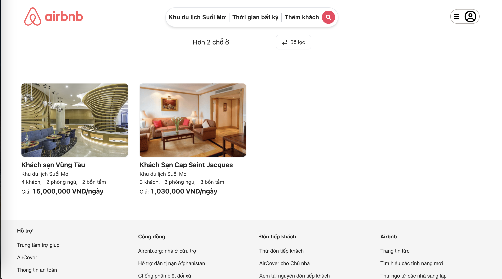

# **Airbnb**

### **A full-featured accommodation booking app, built with ReactJS**

### Click here for [live demo](https://airbnb-bc21.netlify.app/)

## Screenshots

#### Search page:

#### Detail page:

You can see more screenshots in assets/screenshots

## Description

-   **Airbnb** is an opportunity for me to enhance my programming skills and experiment with some new technologies that I've learnt recently (e.g. RESTful API, TailwindCss, Ant Design and ReduxToolkit) as well. The project implements some pages of the original [Aribnb](https://www.airbnb.com.vn/)

## Features

-   [x] Authentication (JWT token is stored in local storage)
-   [x] Search room by location, checkin checkout time and number of guests.
-   [x] Booking room.

## Tech stack

-   **Front-end**
    -   **ReactJS**
    -   **TailwindCSS**
    -   **Ant Design**
    -   **Redux Toolkit**

## Disclaimer

-   **Airbnb** is designed to work well with various screens, so you can experience on your phone as well.

## Credits

-   The UI design is inspired by [Aribnb](https://www.airbnb.com.vn/)
